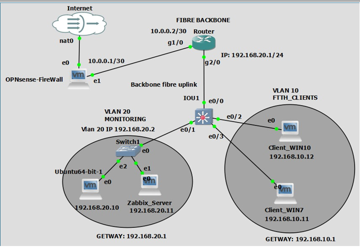

# 🚀 Fibre Optic Network Project

**Author:** Ghaith Riabi  
**GitHub:** https://github.com/ghaithrb  
**Date:** April 2026

---

## 📄 Project Overview

This project demonstrates a complete **fibre optic network setup** including:

- VLAN segmentation for clients and monitoring  
- Cisco routers and switches configuration  
- OPNsense firewall deployment  
- Ubuntu server running Zabbix for monitoring  
- Windows clients with Zabbix agents  
- Secure monitoring using SNMPv3  
- Alerting via Email and Telegram  
- Full GNS3 topology for simulation and testing  

🎯 **Goal:** Provide a professional and reusable network architecture suitable for both lab environments and real-world deployment.

---

## 🖼 Topology & Architecture

### Network Topology



### Components

- **Routers:** router
- **Switches:** Core and access switches  
- **Firewall:** OPNsense (NAT & security)  
- **Server:** Ubuntu (Zabbix monitoring)  
- **Clients:** Windows and Linux machines  

---

## 📂 Project Structure

```
fibre_optic_project_github/
│
├─ clients/              # Windows/Linux client machines
├─ configs/              # Configuration files
│  ├─ opnsense_config.txt
│  ├─ router_config.txt
│  ├─ switch_config.txt
│  ├─ snmp_router.txt
│  ├─ snmp_switch.txt
│  ├─ ubuntu_network.yaml
│  ├─ zabbix_install.sh
│  └─ windows_steps.txt
│
├─ docs/                 # Documentation
│  └─ rapport.docx
│
├─ firewall/             # Firewall backups
├─ gns3/                 # GNS3 project files
├─ img/                  # Images
│  └─ architecture.png
│
├─ linux/                # Linux scripts/packages
├─ routers/              # Router backups
├─ scripts/              # Automation scripts
├─ switch/               # Switch backups
├─ switche IOU 1/        # IOU switch configs
├─ topology/             # Additional topology references
```

---

## ⚙️ Device Configurations

### 🔥 OPNsense Firewall
- NAT & routing enabled  
- LAN: `10.0.0.1/24`  
- DHCP: `10.0.0.100 – 10.0.0.200`  
- DNS: `8.8.8.8`  

### 🌐 Cisco Routers
- VLAN 10: `192.168.10.0/24`  
- VLAN 20: `192.168.20.0/24`  
- NAT & DHCP configured  
- Trunk connections to switches  

### 🔀 Switches
- VLAN segmentation (clients, monitoring, management)  
- Trunk links between devices  
- Access ports per VLAN  

### 🖥 Zabbix Server
- Ubuntu configured via **netplan**  
- Zabbix server & agent installed  
- MySQL database initialized  
- Monitoring deployed across clients  

### 📡 SNMP Monitoring
- SNMPv3 enabled on routers & switches  
- Secure authentication (SHA + AES-128)  
- Integrated with Zabbix  

### 💻 Windows Clients
- Zabbix agent installed  
- Firewall configured  
- Hostname properly set  

---

## 🛠 Installation & Setup

1. Restore configurations using provided `.txt` / `.cfg` files  
2. Deploy OPNsense (restore backup if needed)  
3. Import GNS3 topology (`fibre projet.gns3`)  
4. Configure Ubuntu using:
   - `zabbix_install.sh`
   - `ubuntu_network.yaml`  
5. Install Zabbix agents on all clients  
6. Verify SNMP in Zabbix frontend  
7. Configure alerts (Email + Telegram)  

---

## 📈 Monitoring & Alerts

- **Zabbix Web Interface:**  
  `http://<Zabbix-server-ip>/zabbix`

- **Alerts:** Email (SMTP) & Telegram  

### Metrics Monitored:
- Device availability  
- Interface bandwidth  
- Packet loss  
- CPU & memory usage  

---

## 📌 Notes

- Fully modular and reusable architecture  
- Works on real hardware and GNS3  
- Easily scalable (more VLANs, servers, etc.)  

---

## 💾 Screenshots

- See `img/architecture.png` for full network diagram  

---

## 🔗 Author & Repository

👤 **Ghaith Riabi**  
🔗 https://github.com/ghaithrb

